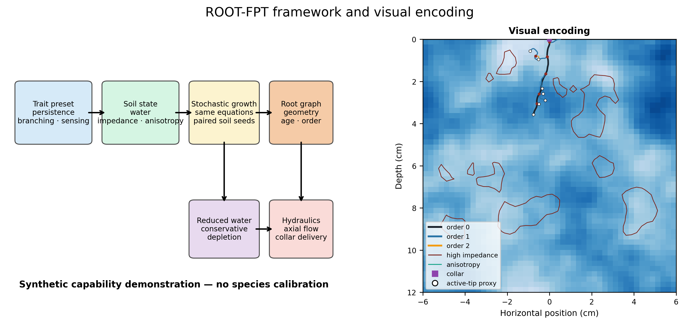

# ROOT-FPT Explorer

[](LICENSE)
[](pyproject.toml)

ROOT-FPT is research software for controlled experiments with persistent
stochastic root-tip motion, developmentally delayed branching, heterogeneous
synthetic soils, explicit root graphs, and terminal hydraulic analysis. The
browser app is designed for exploration, paired comparisons, numerical smoke
tests, and analysis-ready downloads.

> **Scientific boundary:** the model is two-dimensional, synthetic, and
> uncalibrated. Preset names describe parameter combinations, not species.
> Outputs are not field predictions, biological evidence, or management advice.



## Try the app

The Streamlit entry point is [`streamlit_app.py`](streamlit_app.py). The hosted
URL will be added here after the repository owner authorizes the Community
Cloud deployment.


Run it locally:

```bash
git clone https://github.com/nalin-dhiman/Plantroot.git
cd Plantroot
python -m venv .venv
source .venv/bin/activate
python -m pip install -r requirements.txt
streamlit run streamlit_app.py
```

The app provides four bounded workspaces:

- **Explore:** run one deterministic-by-seed root–soil realization, inspect
  geometry and depth distribution, and download segments and metrics.
- **Paired comparison:** compare two architecture presets using the same soil
  realization for each replicate.
- **Diagnostics:** compare 0.04-day and 0.02-day integrations and inspect
  hydraulic and construction-accounting residuals.
- **Model & limits:** inspect the represented mechanisms and the missing ones.

The interactive sample sizes are intentionally small enough for a shared web
service. They are useful for checking behavior and building hypotheses, not
for population inference.

## Python API

```python
from rootfpt.explorer import result_signature, run_experiment, segment_frame

run = run_experiment(
    "dimorphic",
    "patchy_matern",
    seed=20260802,
    replicate=0,
    duration_days=5.5,
    dt_days=0.04,
)

print(run.metrics)
print(result_signature(run))
segments = segment_frame(run)
```

See [API.md](API.md) and [`tutorials/`](tutorials) for lower-level examples.

## Installation for development

Python 3.11 and 3.12 are supported.

```bash
python -m venv .venv
source .venv/bin/activate
python -m pip install -r requirements-dev.txt
pytest -q
ruff check .
```

## Repository layout

```text
streamlit_app.py          browser application
src/rootfpt/              simulation, metrics, hydraulics, and app helpers
configs/                  explicit synthetic presets and example selectors
tests/                    analytical, stochastic, conservation, and UI tests
tutorials/                small executable examples
workflows/                command-line research workflows
assets/                   software diagrams used by the documentation
```

This public repository intentionally contains software and software-facing
documentation only. Generated research narratives and private working
materials are outside its release boundary.

## Reproducibility

- Every stochastic run requires an explicit master seed and replicate index.
- Environment seeds depend only on soil and replicate, enabling paired
  architecture comparisons.
- Developmental events use identity-keyed random streams.
- Nested numerical resolutions query a common Brownian path.
- Downloads include settings, named seeds, metrics, root segments, depth
  profiles, and an exact segment-table SHA-256.

For consequential analysis, use an ensemble, retain failed runs, test numerical
resolution, and record the repository commit. A visually interesting seed is
not a representative sample.

## Known limitations

- Root development is represented in two spatial dimensions.
- Soil constructors are controlled inputs rather than empirical soil profiles.
- The reduced soil-water assay is not Richards flow.
- Terminal hydraulic analysis does not feed water uptake back into development.
- Parameters are not calibrated to a species, genotype, field site, or treatment.
- The app is a bounded interface; large ensembles should use Python workflows.

## Contributing and support

Read [CONTRIBUTING.md](CONTRIBUTING.md) before opening a pull request. Report
reproducible defects through [GitHub Issues](https://github.com/nalin-dhiman/Plantroot/issues)
with the seed, settings, platform, and commit hash.

## License and citation

The software is available under the [MIT License](LICENSE). Citation metadata
is provided in [CITATION.cff](CITATION.cff).
