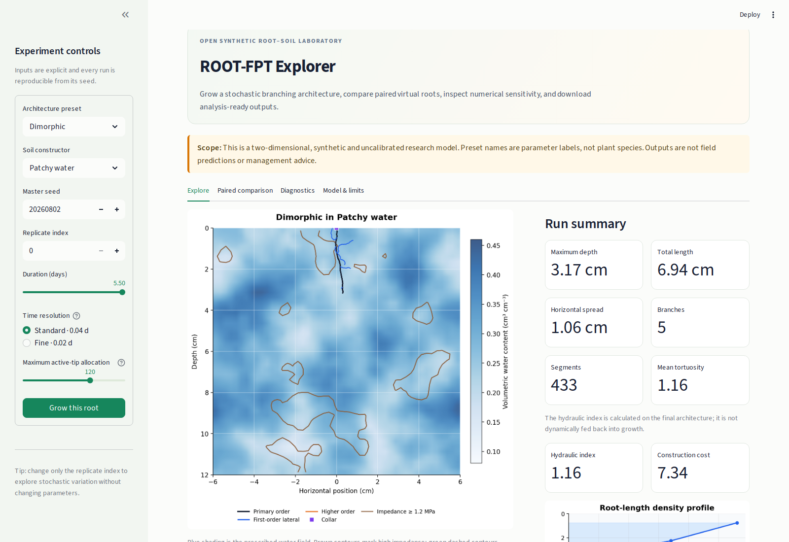
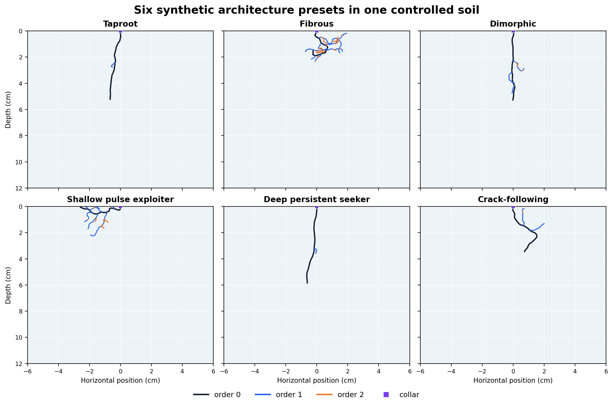

# ROOT-FPT Explorer

[](LICENSE)
[](pyproject.toml)

ROOT-FPT is open research software for controlled experiments with persistent
stochastic root-tip motion, delayed branching, synthetic heterogeneous soils,
explicit root graphs, and terminal hydraulic analysis. The Streamlit explorer
runs single realizations, small paired comparisons, numerical smoke tests, and
analysis-ready exports.

> **Scientific boundary:** this is a two-dimensional, synthetic, uncalibrated
> model. Preset names are parameter combinations, not species. Outputs are not
> field predictions, biological validation, or management advice.




## What can be explored?



The presets above use the same simulator, domain, duration, and homogeneous
soil constructor. They are deliberately contrasting configurations—not claims
about real taxa or optimal root systems.

The app has four workspaces:

- **Explore:** grow one deterministic-by-seed architecture, inspect its graph
  and depth profile, and download metrics and segments.
- **Paired comparison:** compare two presets against identical synthetic soil
  realizations. Interactive samples are intentionally small and exploratory.
- **Diagnostics:** compare 0.04-day and 0.02-day integrations and inspect
  hydraulic and construction-accounting residuals.
- **Model & limits:** see which mechanisms are represented and which are not.

Downloads contain settings, named seeds, metrics, the segment table, the
root-length-density profile, and an exact segment-table SHA-256.


## Research-use checklist

- Record the repository commit, Python version, configuration, seed, and
  replicate index.
- Use paired environment seeds when comparing architecture presets.
- Use ensembles for uncertainty; a visually interesting realization is not a
  representative sample.
- Check numerical resolution for conclusions sensitive to event timing.
- Retain failures and define exclusions before running an experiment.
- Treat hydraulic and construction outputs as model indices unless separately
  calibrated and validated.

## Known limitations

- Root development is represented in two spatial dimensions.
- Soil constructors are controlled inputs rather than empirical profiles.
- The reduced soil-water assay is not Richards flow.
- Terminal hydraulic analysis does not feed water uptake back into development.
- Parameters are not calibrated to a species, genotype, field site, or treatment.
- Large ensembles belong in scripted workflows, not the shared web interface.


Before a release, run the installation doctor, tests, lint, and public-release
boundary check on a clean Python 3.11 or 3.12 environment. The repository is
ready for Streamlit Community Cloud, but deployment requires authorization
from the repository owner; this README does not advertise an unverified hosted
URL.

## Repository layout

```text
streamlit_app.py          browser application
src/rootfpt/              simulation, metrics, hydraulics, and app helpers
configs/                  explicit synthetic presets and example selectors
tests/                    analytical, stochastic, conservation, and UI tests
tutorials/                small executable examples
workflows/                command-line research workflows
scripts/                  installation, release, and documentation checks
assets/                   reproducible software-facing README images
```

This public repository contains software and software-facing documentation
only. Research-writing and submission materials remain outside its release
boundary.

## Contributing, support, and citation

Read [CONTRIBUTING.md](CONTRIBUTING.md) before opening a pull request. Report
reproducible defects through [GitHub Issues](https://github.com/nalin-dhiman/Plantroot/issues)
with the seed, settings, platform, Python version, and commit hash.

The software is available under the [MIT License](LICENSE). Citation metadata
is provided in [CITATION.cff](CITATION.cff).
